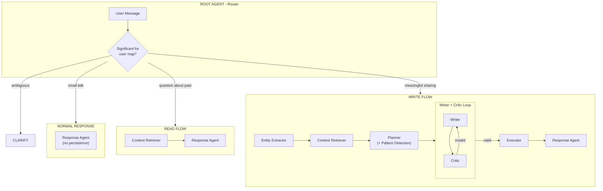
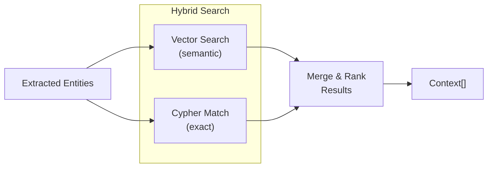

# PRD: Digital Brain Multi-Agent Architecture

> **Historical notice (2026-07):** This PRD describes the early multi-agent MVP.
> Journal chaining is **not** `[:NEXT_ENTRY]` — use the server-owned append
> protocol (`append_journal_entry`, `FOLLOWS`/`HEAD`/`JournalChain`). Authoritative
> write path: `mcp_servers/cypher/README.md` and the digital-brain-buddy write skill.

## Overview

Multi-agent workflow system for the Digital Brain that processes user input, extracts entities, searches for context, writes to Neo4j, and detects patterns/insights.

## Goals

**MVP Focus:** Simple, working flow first. Add complexity later.

1. **Reliable memory persistence** — meaningful user input saved to graph
2. **Context-aware responses** — use past data to inform conversation
3. ~~**Pattern detection**~~ — *v2 feature*
4. **Separation of concerns** — modular agents

---

## Technical Constraints

> **⚠️ IMPORTANT: Maximize ADK library usage**

1. **Use ADK built-in classes** — `LlmAgent`, `SequentialAgent`, `LoopAgent`, etc.
2. **No custom wrappers** — if ADK has a solution, use it
3. **Ask user before custom code** — if custom class/wrapper seems necessary, confirm with user first
4. **MCP Toolset** — use `McpToolset` for all Neo4j interactions

```python
# ✅ Preferred
from google.adk.agents import LlmAgent, SequentialAgent, LoopAgent

# ❌ Avoid unless approved
class CustomAgent(BaseAgent):
    pass
```

---

## Architecture


```mermaid
flowchart TB
    subgraph ROOT["ROOT AGENT - Router"]
        input["User Message"]
        router{"Significant for<br/>user map?"}
    end

    subgraph SKIP["NORMAL RESPONSE"]
        skip_resp["Response Agent<br/>(no persistence)"]
    end

    subgraph READ["READ FLOW"]
        search["Context Retriever"]
        read_resp["Response Agent"]
    end

    subgraph WRITE["WRITE FLOW"]
        extract["Entity Extractor"]
        context["Context Retriever"]
        planner["Planner<br/>(+ Pattern Detection)"]
        subgraph LOOP["Writer + Critic Loop"]
            writer["Writer"] --> critic["Critic"]
            critic -->|invalid| writer
        end
        executor["Executor"]
        write_resp["Response Agent"]
    end

    input --> router
    router -->|"small talk"| SKIP
    router -->|"question about past"| READ
    router -->|"meaningful sharing"| WRITE
    router -->|"ambiguous"| CLARIFY
    search --> read_resp
    extract --> context --> planner --> LOOP
    LOOP -->|valid| executor --> write_resp
```

---

## Example Conversation

### Turn 1: Small Talk → SKIP

**User:** "Hi!"

**Root Agent:** `route = SKIP` (no significance)

**Response Agent:** "Hi! How are you today?"

**Persisted:** ❌ Nothing

---

### Turn 2.5: Ambiguous Intent → CLARIFY

**User:** "Fine, my father got on my nerves"

**Root Agent:** `route = CLARIFY` (potential event, needs more context)

**Response Agent:** "What happened with your father? Tell me more."

**User:** "He started talking about work again — that I need something more stable"

**Root Agent:** `route = WRITE` (now clear event)

**AI synthesizes JournalEntry.content:**
> "I argued with my father today. He started talking about work again and said I need to find something more stable."

**Persisted:** ✅ JournalEntry (synthesized) + Event + Person

---

### Turn 3: Meaningful Sharing → WRITE_FLOW

---

### Turn 3: Meaningful Sharing → WRITE_FLOW

**User:** "I argued with my father about work again today. He said I need to find a real job."

**Root Agent:** `route = WRITE` (event + emotions + person + pattern "again")

**WRITE_FLOW execution:**

| Agent | Action |
|-------|--------|
| Entity Extractor | `{mood: "frustrated", entities: [Person("father"), Topic("work")], event: "conflict", pattern: "recurring"}` |
| Context Retriever | Hybrid search → Finds 2 past conflicts with father about work |
| Planner | Plan: CREATE JournalEntry, CREATE Event, MERGE Person, CREATE State, CREATE Insight("pattern: conflicts with father about work") |
| Writer | Generates 5 Cypher queries |
| Critic | ✅ Valid |
| Executor | Executes queries |

**Persisted:**
```
(:JournalEntry {content: "I argued with my father again today...", embedding: [...], timestamp: "2025-12-08"})
  -[:DESCRIBES]-> (:State {name: "frustrated"})
  -[:MENTIONS]-> (:Person {name: "father", relation: "father"})
  -[:TRIGGERED]-> (:Event {type: "conflict", timestamp: "2025-12-08"})
                    -[:ABOUT]-> (:Topic {name: "work"})

(:Insight {content: "3rd conflict with father about work this month"})
```

**Response Agent:** "This is already the third time this month you two argue about work. Last time he said the same thing about a 'real job'. What does his approval mean to you? Why does it matter so much?"

---

### Turn 4: Question About Past → READ_FLOW

**User:** "When did I last talk about the fear of saying no?"

**Root Agent:** `route = READ` (question about past)

**READ_FLOW execution:**

| Agent | Action |
|-------|--------|
| Context Retriever | Vector search: "fear of saying no" → Finds JournalEntry from 2025-11-20 |

**Found:**
```
(:JournalEntry {content: "I realized I am afraid to say no to colleagues...", timestamp: "2025-11-20"})
  -[:DESCRIBES]-> (:Insight {content: "pattern: people-pleasing"})
```

**Response Agent:** "November 20. You said you realized you were afraid to say no to colleagues. We talked about how that linked to wanting to be 'good'. Has anything changed since then?"

**Persisted:** ❌ Nothing (read-only)

---

## Agent Specifications

### 1. Root Agent (Router)
- **Input:** User message + session context
- **Output:** Route to SKIP, READ_FLOW, or WRITE_FLOW
- **Logic:** Classify significance for user personality map

| Input Example | Route | Reason |
|---------------|-------|--------|
| "Hi, how are you?" | SKIP | Small talk, no value |
| "Fine, working" | SKIP | Generic, no insights |
| "I argued with my father about work" | WRITE | Event + emotions + people |
| "I realized I am afraid to say no" | WRITE | Self-insight |
| "When did I last talk about work?" | READ | Query about past |

### 2. Entity Extractor (+ Query Expansion)
- **Input:** Raw user text
- **Output:** 
  ```json
  {
    "mood": "frustrated",
    "entities": [{"type": "Person", "name": "father"}],
    "event_type": "conflict",
    "patterns": ["recurring"],
    "timestamp": "2025-12-08T01:00:00Z",
    "search_queries": [
      "father started again",
      "conflict with father",
      "argument with dad",
      "Father criticized my work again. He thinks I need to find something more stable."
    ]
  }
  ```

- **Query Expansion Logic:**
  1. **Original** — raw user input
  2. **Synonyms** — dad = father, argument = conflict
  3. **HyDE** — "How might this have been written down earlier?" (hypothetical document)

### 3. Context Retriever (Hybrid Search)

- **Input:** Extracted entities from Entity Extractor
- **Tools:** `read_neo4j_cypher` with `embed_text` parameter
- **Output:** 
  - Related past entries
  - Last JournalEntry ID (for `[:NEXT_ENTRY]` linking)
  - Existing nodes to MERGE

#### Hybrid Search Strategy


```mermaid
flowchart LR
    input["Extracted Entities"]
    
    subgraph HYBRID["Hybrid Search"]
        vector["Vector Search<br/>(semantic)"]
        cypher["Cypher Match<br/>(exact)"]
    end
    
    merge["Merge & Rank<br/>Results"]
    output["Context[]"]
    
    input --> vector
    input --> cypher
    vector --> merge
    cypher --> merge
    merge --> output
```

#### Step 1: Vector Search (Semantic)

Use embeddings for semantic search over `JournalEntry`:

```cypher
// Query pattern for vector search
CALL db.index.vector.queryNodes(
  'journal_entry_embedding_index', 
  $limit, 
  $embedding
) YIELD node, score
WHERE score > 0.7
RETURN node.content AS content, 
       node.timestamp AS timestamp,
       score
ORDER BY score DESC
```

**Parameters:**
- `$embedding` — generated from user input via `embed_text`
- `$limit` — top 5–10 results
- `score > 0.7` — relevance filter

**Batch Search (multiple queries):**
```cypher
// Batch all search_queries into single call
UNWIND $search_queries AS query
CALL db.index.vector.queryNodes('journal_entry_embedding_index', 5, query.embedding) 
YIELD node, score
WITH DISTINCT node, MAX(score) AS best_score
WHERE best_score > 0.7
RETURN node, best_score
ORDER BY best_score DESC
LIMIT 10
```

#### Step 2: Cypher Match (Exact)

Exact lookup on extracted entities:

```cypher
// Find existing Person nodes
MATCH (p:Person)
WHERE toLower(p.name) CONTAINS toLower($person_name)
   OR toLower(p.relation) CONTAINS toLower($person_name)
RETURN p

// Find related Events
MATCH (e:Event)-[:ABOUT]->(t:Topic)
WHERE t.name = $topic
RETURN e, t
ORDER BY e.timestamp DESC
LIMIT 5

// Find past States (emotions)
MATCH (j:JournalEntry)-[:DESCRIBES]->(s:State)
WHERE s.name = $mood
RETURN j, s
ORDER BY j.timestamp DESC
LIMIT 5

// Get last JournalEntry for linking
MATCH (j:JournalEntry)
RETURN j
ORDER BY j.timestamp DESC
LIMIT 1
```

#### Step 3: Merge & Rank Results

```python
def merge_results(vector_results, cypher_results):
    """
    Combine and deduplicate results from both searches.
    Priority: exact match > high semantic score > recency
    """
    combined = []
    
    # Exact matches get highest priority
    for r in cypher_results:
        combined.append({
            "source": "cypher",
            "priority": 1,
            "data": r
        })
    
    # Vector results ranked by score
    for r in vector_results:
        if r not in cypher_results:  # dedupe
            combined.append({
                "source": "vector", 
                "priority": 2,
                "score": r.score,
                "data": r
            })
    
    return sorted(combined, key=lambda x: (x["priority"], -x.get("score", 0)))
```

#### Filtering Strategies

| Filter | Purpose | Query Pattern |
|--------|---------|---------------|
| **Time-based** | Recent events more relevant | `WHERE j.timestamp > datetime() - duration('P30D')` |
| **Entity match** | Find specific people/topics | `WHERE p.name CONTAINS $name` |
| **Relationship depth** | Related concepts | `MATCH path = (j)-[*1..2]-(related)` |
| **Score threshold** | Semantic relevance | `WHERE score > 0.7` |
| **Recency boost** | Prefer recent over old | `ORDER BY score * (1 + 0.1 / days_ago)` |

#### Full Hybrid Query Example

```cypher
// Combined hybrid search query
WITH $user_input AS input

// Vector search
CALL db.index.vector.queryNodes('journal_entry_embedding_index', 10, $embedding) 
YIELD node AS vectorMatch, score

// Cypher exact match
OPTIONAL MATCH (exactPerson:Person)
WHERE toLower(exactPerson.name) CONTAINS toLower($person_name)

OPTIONAL MATCH (exactTopic:Topic)
WHERE exactTopic.name = $topic

// Combine results
WITH vectorMatch, score, exactPerson, exactTopic
WHERE score > 0.7 
   OR exactPerson IS NOT NULL 
   OR exactTopic IS NOT NULL

// Get related context
OPTIONAL MATCH (vectorMatch)-[:DESCRIBES]->(state:State)
OPTIONAL MATCH (vectorMatch)-[:MENTIONS]->(person:Person)
OPTIONAL MATCH (vectorMatch)-[:TRIGGERED]->(event:Event)

RETURN 
    vectorMatch.content AS content,
    vectorMatch.timestamp AS timestamp,
    score,
    collect(DISTINCT state.name) AS states,
    collect(DISTINCT person.name) AS people,
    collect(DISTINCT event.type) AS events
ORDER BY score DESC, timestamp DESC
LIMIT 10
```

### 4. Planner
- **Input:** Entities + context + schema
- **Tools:** `get_neo4j_schema`
- **Logic:**
  - Decide CREATE vs MERGE for each entity
  - Detect patterns from context (e.g., "3rd conflict this month")
  - Include Insight node in plan if pattern found
- **Output:** Query Plan
  ```json
  {
    "nodes_to_create": ["JournalEntry", "Event", "Insight"],
    "nodes_to_merge": ["Person:father"],
    "relationships": ["MENTIONS", "TRIGGERED", "LEADS_TO"],
    "pattern_detected": "recurring conflict about work"
  }
  ```

### 5. Writer + Critic Loop

```python
LoopAgent(
    name="write_validate",
    sub_agents=[writer, critic],
    max_iterations=3  # ⚠️ REQUIRED
)
```

**Writer:**
- **Input:** Query Plan
- **Output:** Cypher queries (text only, no execution)

**Critic:**
- **Input:** Generated Cypher queries
- **Tools:** `get_neo4j_schema` (optional)
- **Output:** Valid/Invalid + feedback
- **Validation:**
  - Syntax correctness
  - Schema compliance
  - Coverage of all entities

**Fallback (after 3 iterations):**
- Log error
- Notify user: "Could not save the entry. Try rephrasing."

### 7. Executor
- **Input:** Validated Cypher queries
- **Tools:** `write_neo4j_cypher`
- **Error handling:** Retry on failure (max 3)
- **Output:** Execution result, created node IDs

### 8. Response Agent
- **Input:** All context + execution result (or just message if SKIP)
- **Output:** User-facing response (frank, direct, psychological)
- **Input:** All context + execution result
- **Output:** User-facing response (frank, direct, psychological)

---

## Schema Contract (Hybrid)

### Core Nodes (Fixed)
| Node | Required Properties | Optional |
|------|---------------------|----------|
| JournalEntry | id, content, timestamp, embedding | summary |
| Person | name | relation, notes |
| Event | type, timestamp | description |
| State | name, intensity (1-10) | - |
| Insight | content, timestamp | confidence |
| Topic | name | - |

### Core Relationships (Fixed)
| Relationship | From → To |
|--------------|-----------|
| NEXT_ENTRY | JournalEntry → JournalEntry |
| DESCRIBES | JournalEntry → State |
| MENTIONS | JournalEntry → Person |
| TRIGGERED | Event → State |
| ABOUT | Event → Topic |
| INFLUENCED | State → Event |
| LEADS_TO | Insight → Insight |

### Dynamic Extensions
- New properties allowed on any node
- New relationship types allowed (validated by Critic)

---

## Session Context

**Current approach:** Local memory (in-process)

- Conversation history stored in memory during session
- Passed to Root Agent for routing decisions
- Used by Response Agent for coherent dialogue

> **TODO:** Consider persistent storage (Redis, PostgreSQL) for production

---

## Error Handling

| Error | Strategy |
|-------|----------|
| Query syntax error | Critic catches, Writer retries |
| Executor failure | Retry (max 3), then log and notify |
| MCP connection loss | Retry connection, fallback response |

---

## Success Metrics

1. **Write success rate** — % of user inputs successfully persisted
2. **Pattern detection accuracy** — relevant insights generated
3. **Response latency** — time from input to response
4. **Context retrieval relevance** — quality of hybrid search results

---

## Scope

### 🎯 MVP (v1)

**Simplified flow:**
```
Root → Entity Extractor → Context Retriever → Writer → Executor → Response
```

| Component | MVP Scope |
|-----------|-----------|
| **Root Agent** | SKIP / READ / WRITE routing (no CLARIFY) |
| **Entity Extractor** | Basic entities, 1 search query (no HyDE) |
| **Context Retriever** | Simple vector search (no multi-query) |
| **Writer** | Direct Cypher generation (no Critic loop) |
| **Executor** | Execute with basic retry |
| **Response Agent** | Basic response |

**MVP Checklist:**
- [ ] Root Agent with 3-way routing
- [ ] Entity Extractor (entities, mood, 1 search query)
- [ ] Context Retriever (vector search only)
- [ ] Writer (generates Cypher)
- [ ] Executor (write_neo4j_cypher)
- [ ] Response Agent
- [ ] JournalEntry creation with embedding

---

### 🚀 Future Features (v2+)

| Feature | Priority | Description |
|---------|----------|-------------|
| CLARIFY route | High | Clarifying questions for ambiguous intent |
| Writer-Critic Loop | High | Validation with max_iterations=3 |
| Multi-query search | Medium | HyDE + synonyms for better RAG |
| Pattern Detection | Medium | Insight nodes for recurring themes |
| Planner Agent | Medium | Schema-aware query planning |
| Batch search | Low | UNWIND for optimization |
| Session persistence | Low | Redis/PostgreSQL for production |
