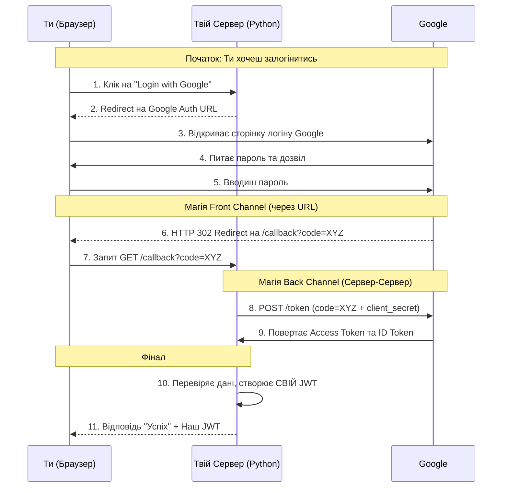

# Модуль 3: Потоки OAuth 2.0 (Flows)

Коли ми говоримо про OAuth, ми говоримо про те, **як саме** отримати той самий JWT токен. І залежить це від того, хто з ким спілкується.

## 1. Client Credentials Flow (Машина з Машиною)
Це найпростіший варіант. Твій Агент заходить на Auth Server, каже свій `client_id` та `client_secret` (пароль), і одразу отримує токен.
- **Коли використовувати**: Коли Агенту (Digital Brain) треба доступ до бази даних або іншого твого сервісу, де немає "живого" користувача.
- **Аналогія**: Службовий вхід для технічного персоналу.

## 2. Authorization Code Flow (Вхід через Google)

Це саме той випадок, про який ти запитав. Давай розпишемо по кроках, як це працює в архітектурі:

1.  **Лінк**: Агент (або твій сайт) генерує лінку на Google. Ти клікаєш і логінишся в Google.
2.  **Redirect (The "Catch")**: Google не робить якийсь секретний запит на твій сервер. Він просто каже твоєму **Браузеру**: "Ей, браузер, тепер іди за цією адресою: `https://твій-сервер.com/callback?code=ABC123XYZ`".
    - `Redirect URI`: Це адреса твого сервера, яку ти заздалегідь прописав у налаштуваннях Google.
    - `Query Parameter`: Код передається прямо в адресному рядку браузера.
3.  **Обмін (Backend)**: Твій сервер "бачить" цей вхідний запит на `/callback`, дістає `code` з адресного рядка і вже **сам** (не через браузер, а напряму "сервер-сервер") відправляє цей код у Google.
4.  **Google Token**: Google повертає інформацію: "Це `cyril@gmail.com`, він успішно залогінився".
5.  **Твій Реєстр**: Твій сервер дивиться в свою базу/реєстр: "Так, у нас є `cyril@gmail.com`, він у нас Адмін".
6.  **Наш JWT (Фінал)**: Сервер викликає наш **`jwt_handler.encode({"sub": "cyril", "role": "admin"})`**.

**Результат**: Агент отримує **наш** токен, якому довіряють наші тулзи. Google тут виступив просто як "наддійний свідок", який підтвердив твою особу.

*Чому ми не використовуємо токен самого Google для наших тулз?*
Бо Google не знає про твої права в твоїй системі (наприклад, що ти маєш право видаляти записи в Neo4j). Google каже тільки "це він". А ми вже самі вирішуємо, що йому можна.

### 2.1. Як ми "розпаковуємо" токен Google? (OIDC)

Це магія стандартів. Важливо розуміти: **OIDC — це не база даних, це протокол (набір правил).**

> [!IMPORTANT]
> Не існує "відкритої бази з даними юзерів". Дані твого профілю в Google — приватні. "Відкритими" є лише **Ключі для перевірки**.

1.  **Відкриті ключі (Public Keys)**: Це як цифрова печатка Google. Google викладає ці ключі у відкритий доступ (JWKS), щоб будь-який сервер у світі міг перевірити: "Чи справді цей токен підписав Google?". Це не дає доступу до списку юзерів, це лише інструмент перевірки.
2.  **Протокол (OIDC)**: Це домовленість між Google і твоїм сервером про те, в якому форматі передавати дані. Наприклад, домовленість, що поле з імейлом завжди буде називатися `email`.
3.  **Приватність**: Дані про тебе потрапляють на твій сервер **тільки після того**, як ти натиснув кнопку "Дозволити". Google створює токен конкретно для твого Агента і підписує його.

**Чому ми знаємо, як це робити?**
Бо твій сервер знає "адресу", за якою лежать ключі Google. Бібліотека (наприклад, `google-auth`) завантажує ці ключі, бере токен від Агента і каже: "Математика сходиться, це точно Google підтвердив особу Cyril".

### 2.2. Чому Код, а не Дані? (Безпека каналів)

Це головне питання безпеки OAuth. Існує два канали передачі даних:

1.  **Front Channel (Браузер)**: Він вважається **ненаддійним**. Все, що потрапляє в адресний рядок браузера, записується в історію, в логи провайдера, і може бути перехоплено шкідливими розширеннями.
    -   Якби Google передав токен або твої дані прямо в URL, хакер міг би їх легко "піддивитися".
2.  **Back Channel (Сервер-Сервер)**: Це пряме зашифроване з'єднання між твоїм сервером і сервером Google. Воно **надійне** і ніхто ззовні його не бачить.

**Логіка Коду**:
-   Google передає через браузер (Front Channel) лише **одноразовий тимчасовий Код**. Сам по собі він нічого не вартий.
-   **Головний замок**: Коли твій сервер йде до Google (через Back Channel), він має пред'явити два ключі:
    1.  **Code** (той самий, що передав юзер).
    2.  **client_secret** (твій таємний пароль, який ти отримав при реєстрації свого застосунку в Google).
-   **Чому хакер не може це зробити?** Хакер може вкрасти `Code` (бо він був у браузері), але він **не знає** твій `client_secret`. Google каже: "Ти приніс мені код, але ти не мій довірений Агент, бо ти не знаєш секретний пароль. Відмовлено".

### 2.3. Client ID та Client Secret: Паспорти для софту

Це дуже важливий момент, де ламається мізок. Існує два типи "паролів":

1.  **Твій пароль (User Password)**: Його знаєш тільки ти і Google. Ти вводиш його на сторінці Google. Агент його **ніколи не бачить**.
2.  **Client Secret (Application Password)**: Це пароль твого **Агента/Сервера**. 
    -   Коли ти створюєш проєкт у Google Cloud Console, Google дає тобі `client_id` (логін програми) та `client_secret` (пароль програми).
    -   Цей секрет прошитий у тебе в коді сервера (або в `.env`).

### 2.4. Як відкривається Back Channel? (Технічне м'ясо)

Ти запитав: *"Де в цьому механізмі secret?"*. Дивись на таймлайн:

1.  **Front Channel (Браузер)**: Google редіректить тебе на `https://твій-сервер.com/callback?code=ABC`. 
2.  **Callback спрацював**: Твій сервер отримав запит. В цей момент браузер просто "чекає" відповіді (крутиться колечко завантаження).
3.  **Back Channel (Магія)**: Поки браузер чекає, твій сервер "під капотом" робить звичайний **HTTP POST запит** до Google (на адресу `https://oauth2.googleapis.com/token`). 
    -   Це і є Back Channel — пряме з'єднання твого Python-коду з сервером Google.
    -   В тіло цього POST-запиту сервер кладе: `code` + `client_id` + `client_secret`.
4.  **Google перевіряє**: "Так, код правильний, і секретний пароль програми `AvatarBrain` теж правильний. Ось вам токени".
5.  **Фінал**: Твій сервер отримує токени, записує їх собі, і тільки після цього відправляє відповідь у браузер: "Успіх! Можеш закривати вікно".

### 2.5. Механіка: Хто, коли та куди «стукає»?

Давай розберемо це як послідовність фізичних подій. У нас є 3 учасники: **Ти (Браузер)**, **Твій Сервер (Python)** та **Google**.



#### Технічні деталі (відповіді на твої питання):

- **Хто чекає?**: На кроці 7, коли твій браузер переходить за лінкою `/callback`, він надсилає запит твоєму серверу і «зависає». Твій сервер (Python) отримує цей запит і, замість того щоб одразу відповісти, він сам «йде в гості» до Google (крок 8). Браузер весь цей час чекає.
- **Чи є callback функцією?**: У Python (наприклад, у Flask або FastAPI) ти справді пишеш функцію, яка прив'язана до адреси `/callback`. 
    ```python
    @app.get("/callback")
    def handle_google_callback(code: str):
        # 1. Ми отримали код
        # 2. Робимо запит до Google з нашим secret
        # 3. Видаємо свій токен
        return {"jwt": "..."}
    ```
- **Де Secret?**: Він з'являється тільки на кроці 8. Твій Python-код дістає його з налаштувань сервера і відправляє в Google разом із кодом, який приніс браузер.

### 2.6. Хто має «приносити» ключі? (Розробник vs Користувач)

Ось тут найважливіший момент, щоб ти не хвилювався за юзерів:

> [!IMPORTANT]
> **Юзер нічого не створює в Google Console.** 
> Тільки **ТИ (як розробник)** один раз створюєш проєкт у Google, отримуєш один `client_id` та один `client_secret` і прописуєш їх у свій `.env`. Юзер цього взагалі не бачить.

#### Аналогія: Нічний клуб
- **Google** — це Паспортний стіл.
- **Твій Сервер** — це Власник нічного клубу.
- **Юзер** — це Гість.

Порядок дій:
1.  **Ти (Власник клубу)** заздалегідь йдеш у "Паспортний стіл" (Google Cloud Console) і кажеш: *"Я відкриваю клуб 'Digital Brain'. Дайте мені ліцензію"*. 
2.  Google каже: *"Ось тобі ліцензія (**client_id**) та секретний код (**client_secret**)"*. Ти ховаєш їх у сейф на сервері.
3.  **Гість (Юзер)** приходить до твого клубу. Він не має жодних ліцензій. Він просто показує **свій паспорт** (логіниться у свій Google-акаунт).
4.  Google підтверджує: *"Це валідний паспорт, ось вам тимчасовий квиток (код)"*.
5.  **Ти (Власник)** береш цей квиток, дістаєш свою **ліцензію (secret)** зі свого сейфу і питаєш Google: *"Я маю ліцензію і ось квиток гостя. Дай мені тепер його дані"*.

**Отже:** У твоїй системі буде тільки **один** `client_secret` на весь твій Digital Brain. Юзерам не потрібно нічого створювати, вони просто тиснуть кнопку "Sign in with Google".

### 2.7. Сценарій: Агент хоче доступ до твого GitHub

Ти запитав: *"А якщо юзер власник GitHub і хоче дати доступ Агенту?"*. Це класика OAuth!

Давай розберемо, хто що робить у цьому випадку:

1.  **Ти (Розробник)**: Йдеш у GitHub і реєструєш там свій застосунок "Digital Brain". Отримуєш `client_id` та `client_secret` **від GitHub для своєї програми**.
2.  **Твій Юзер**: Заходить до твого Агента і каже: *"Хочу підключити свій GitHub"*.
3.  **Твій Сервер**: Редіректить юзера на GitHub, але додає параметр **`scope=repo,user`** (це список прав: "читати репозиторії", "бачити профіль").
4.  **Юзер на GitHub**: Бачить вікно: *"Програма Digital Brain просить доступ до ваших репозиторіїв. Дозволити?"*.
    -   Юзер просто тисне **"Дозволити"**. Він не має нічого реєструвати.
5.  **Твій Сервер**: Отримує `code`, додає СВІЙ `client_secret` (який ти отримав на кроці 1) і обмінює його на **Access Token**.

**Результат**: Твій сервер тепер має токен, який дозволяє йому "ходити" в GitHub від імені цього конкретного юзера. Але `client_secret` все одно тільки твій один.

---

## 3. Нащо нам Refresh Token?
Токени (Access Tokens) зазвичай живуть недовго (30-60 хв) для безпеки. Щоб Агент не питав тебе пароль кожну годину, використовується **Refresh Token**. Це "довговічний" ключ, який дозволяє Агенту отримати новий Access Token без твоєї участі.

---
### Архітектура в нашому проєкті:
Ми інтегруємо OAuth так, щоб твій Агент міг автоматично оновлювати свої права доступу до MCP інструментів, не турбуючи тебе, поки у нього є дійсний Refresh Token.

### 2.8. Де лежить токен і як Агент ним «користується»?

Ти ставиш питання на мільйон доларів! 💰 Давай розберемося, чому Агенту краще **не бачити** твій токен від GitHub.

#### 1. Де зберігається зовнішній токен (Access Token GitHub)?
Він зберігається на **Твоєму Сервері (Backend)**. 
- Наприклад, у базі Neo4j.
- Він прив'язаний до твого внутрішнього ID: `User(Cyril) -> GitHub_Token(ghp_123...)`.
- Юзер (ти) нікуди цей токен не носить. Він лежить у сейфі на сервері.

#### 2. Що тоді зберігає Агент?
Агент зберігає тільки **НАШ ВНУТРІШНІЙ JWT** (твою перепустку до наших інструментів). 
В ньому може бути написано: `{"sub": "cyril", "role": "admin"}`.

#### 3. Як відбувається виклик тулзи? (Процес)

1.  **Агент**: Каже: *"Я хочу створити репозиторій"*. Він викликає інструмент `github_create_repo` і передає йому **НАШ JWT**.
2.  **Інструмент (Тулза)**: Це код на твоєму сервері. Він:
    - Приймає наш JWT.
    - Декодує його і бачить: *"О, це Кирило (ID: cyril)"*.
    - Сервер йде в свою базу і каже: *"Дай мені токен GitHub для Кирила"*.
    - Отримує токен і **сам** робить запит до GitHub API.
3.  **Результат**: Тулза повертає Агенту відповідь: *"Репозиторій створено"*.

#### Чому це безпечно?
- **Агент не бачить твого пароля від GitHub**. Якщо Агента "переконають" через промпт віддати всі свої дані, він віддасть наш JWT, але не твій ключ від GitHub.
- **Захист від витоку**: Твій GitHub-ключ ніколи не покидає межі твого сервера.

---

### 2.9. "Білі плями": Як дані та токени зв'язуються докупи

Ти правий, в описі були прогалини. Давай заповнимо їх технічно:

#### 1. Звідки береться Email? (ID Token)
Коли твій сервер отримує відповідь від Google, він приходить не з одним токеном, а з цілим пакетом:
- **`id_token`**: Це JWT. Твій сервер його розпаковує. Всередині нього **вже є** поле `"email": "cyril@gmail.com"`. Завдяки цьому ми знаємо, хто прийшов.
- **`access_token`**: Це просто рядок (не JWT). Він дозволяє ходити в GitHub/Google.

#### 2. Де ми це зберігаємо? (База даних)
У твоїй системі (наприклад, у Neo4j) ти створюєш вузол `User`. 
```cypher
MERGE (u:User {email: "cyril@gmail.com"})
SET u.github_access_token = "ghp_ABC123..."
```
Так ми назавжди (або поки не прострочиться) зв'язуємо твій імейл з твоїм ключем до GitHub у нашому внутрішньому сейфі (базі даних).

#### 3. Наш JWT (Перепустка для Агента)
Тепер сервер видає Агенту **Наш JWT**. В ньому написано тільки: `{"sub": "cyril@gmail.com"}`. 

#### 4. Механіка "Врапера" (Тулза-Проксі)
Це саме те, що ти назвав "врапером". У ADK (або MCP) це виглядає так:

1.  **Агент** викликає тулзу `github_search(query="python")`.
2.  **Наш JWT** автоматично додається до цього виклику (це робить наш Security Layer).
3.  **Врапер (Security Middleware)** перехоплює запит і робить три речі:
    - **А)** Декодує наш JWT -> отримує `cyril@gmail.com`.
    - **Б)** Йде в Neo4j -> шукає юзера `cyril@gmail.com` -> забирає його `github_access_token`.
    - **В)** Підставляє цей токен у Header справжнього запиту до GitHub.

**Результат**: Агент отримав дані, але він ніколи не бачив твій справжній ключ від GitHub. Він бачив лише результат роботи "врапера".

---

**Твоє завдання в майбутньому**: Реалізувати обмін коду на токен. Але спочатку — закриваємо Модуль 1!
